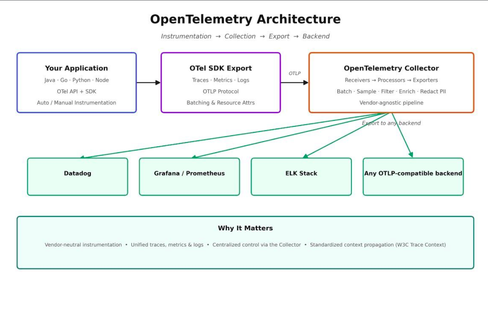

# Application Performance Monitoring Tools - 
New Relic
Dynatrace - Costly
Datadog
AppDynamics 

Cost & License is dependent on amount of data will process

APM Tools helps developers and IT teams monitor, manage & optimize the performance and availability of software applications.

New Relic - 
Full Stack monitoring
Rela Time analytics
Easy Integrations
Developer frinedly
Alerts+AI
Scalability

# New Relic 
New Relic is 100% CLoud Based solution.
New Relic is for Backend based applications like nodejs, java, Python, .NET, 
nr-agent needs to be installed on source servers 

# New Relic Integartion with nodejs application Backend servers

 $ npm install newrelic --save          # Run this command on Backend servers
 $ NEW_RELIC_APP_NAME=backend-dev NEW_RELIC_LICENSE_KEY=hhnmknswhiejlnxs node -r newrelic YOUR_MAINFILENAME.js

 ## OpenTelemetry

OpenTelemetry Architecture-The Way I Think About It as an SRE

OpenTelemetry is not an observability platform. It’s the infrastructure that moves observability data.

Think about how we build applications.

We don’t let every application communicate directly with the database. We place an API or service layer in between to standardize, secure, and control the flow.

OpenTelemetry follows the same architectural principle.

Each layer has only one responsibility.

Application -
Focuses on business logic not observability vendors.

OpenTelemetry SDK -
Generates telemetry (traces, metrics, and logs) using open standards.

OpenTelemetry Collector -
This is where the architecture becomes interesting.

It acts as the telemetry control plane.

Instead of applications talking directly to Datadog, Grafana, or another backend, they send telemetry to the Collector.

The Collector then decides:

* Where should this telemetry go?
* Should it be sampled?
* Should sensitive data be removed?
* Should it be enriched with additional metadata?
* Should it be sent to one backend or multiple?

The application doesn’t need to know.

That’s architectural decoupling.

Finally, the observability platform stores, correlates, visualizes, and alerts on the telemetry.

 

Why does this matter for SREs?

Because observability should evolve without constantly changing application code.

Need to migrate to another observability backend?
Update the Collector’s exporters, not every application.

Need to send telemetry to multiple platforms?
Configure multiple exporters in the Collector.

Need to reduce observability costs?
Adjust sampling and filtering policies in the telemetry pipeline.

Need to enrich every trace with additional metadata?
Do it once in the Collector pipeline.

Need to standardize observability across hundreds of services?
Use OpenTelemetry as the common instrumentation standard.

That’s the beauty of the architecture.

It separates telemetry generation, telemetry processing, and telemetry consumption making observability scalable, resilient, and vendor neutral.